# Customer Churn Analysis

Analysis of **10,000 bank customer records** to identify what drives churn, which segments are highest-risk, and how to retain at-risk customers.

| Metric | Value |
|--------|-------|
| Total customers | 10,000 |
| Overall churn rate | **20.4%** |
| Card types | DIAMOND · GOLD · PLATINUM · SILVER |
| Countries | France · Germany · Spain |
| Prediction models | Logistic Regression · Decision Tree |

---

## Key Findings

- **Germany churns at 2× the rate** of France and Spain (32.4% vs ~16%)
- **All four card types in Germany** are the top 4 highest-risk segments
- **Complaints are the #1 churn predictor** — by a wide margin (LR coefficient 5.18, DT importance 99.7%)
- **Inactive members** are significantly more likely to churn
- **Age** is the second strongest predictor after complaints

---

## Churn by Country

| Country | Churn Rate | Customers | Avg Balance | Complaint Rate |
|---------|-----------|-----------|-------------|----------------|
| 🇩🇪 Germany | **32.4%** | 2,509 | €119,730 | 32.6% |
| 🇪🇸 Spain | 16.7% | 2,477 | €61,818 | 16.7% |
| 🇫🇷 France | 16.2% | 5,014 | €62,093 | 16.2% |

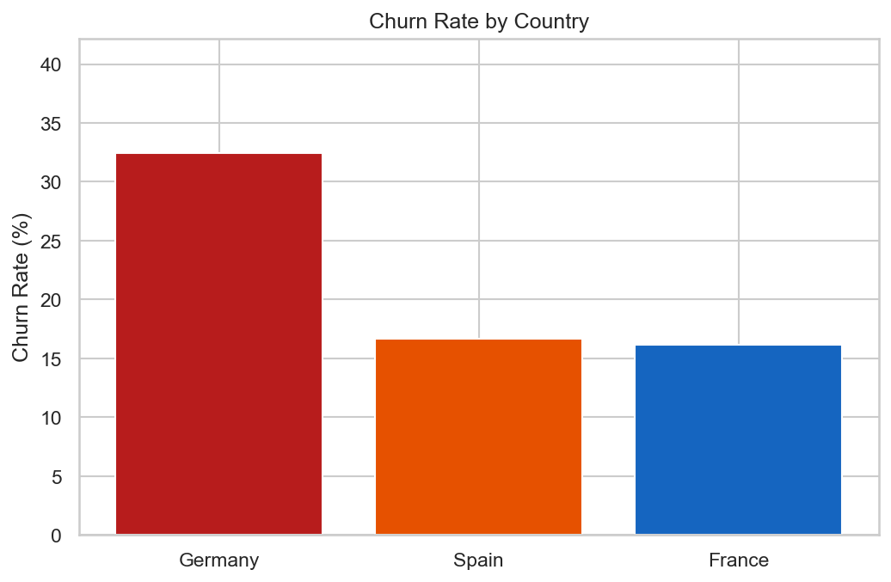

---

## Churn by Card Type

| Card Type | Churn Rate | Customers | Avg Balance | Complaint Rate |
|-----------|-----------|-----------|-------------|----------------|
| 💎 DIAMOND | **21.8%** | 2,507 | €79,120 | 21.8% |
| 🏅 PLATINUM | 20.4% | 2,495 | €75,693 | 20.5% |
| 🥈 SILVER | 20.1% | 2,496 | €74,423 | 20.1% |
| 🥇 GOLD | 19.3% | 2,502 | €76,695 | 19.3% |

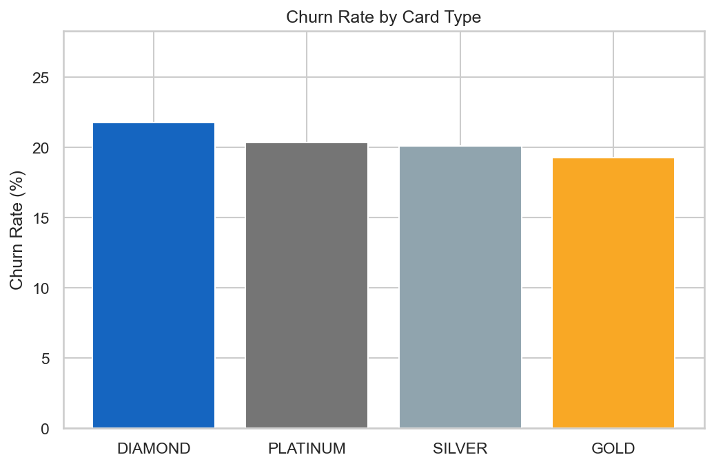

---

## Card Type × Country Heatmap

Churn rates across all 12 segment combinations. Germany stands out across every card type.

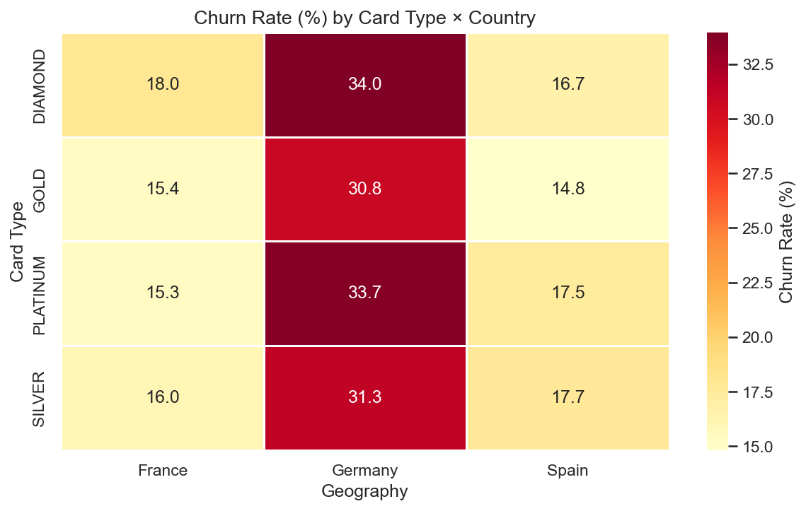

---

## Highest-Risk Segments

| Rank | Card Type | Country | Churn Rate | Customers | Complaint Rate |
|------|-----------|---------|-----------|-----------|----------------|
| 1 | DIAMOND | 🇩🇪 Germany | **34.0%** | 648 | 34.0% |
| 2 | PLATINUM | 🇩🇪 Germany | **33.7%** | 608 | 34.0% |
| 3 | SILVER | 🇩🇪 Germany | **31.3%** | 600 | 31.3% |
| 4 | GOLD | 🇩🇪 Germany | **30.8%** | 653 | 31.2% |
| 5 | DIAMOND | 🇫🇷 France | 18.0% | 1,230 | 18.0% |

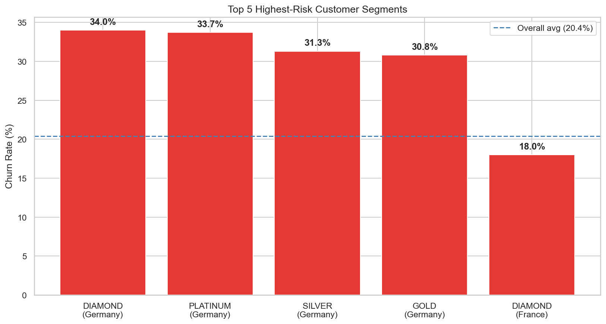

---

## Feature Distributions

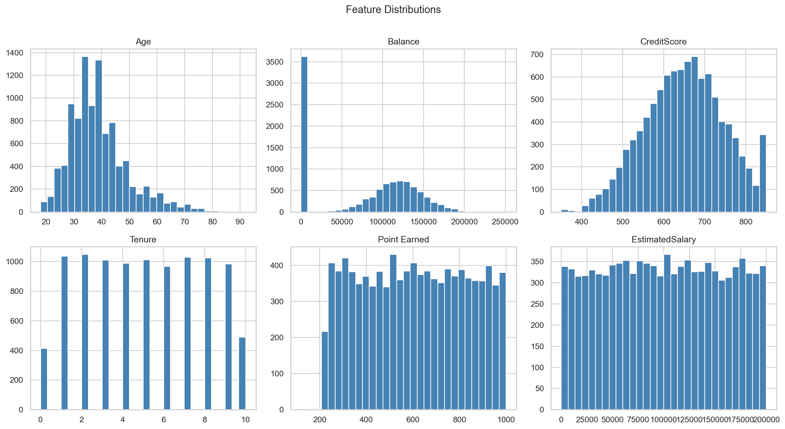

---

## Correlation Heatmap

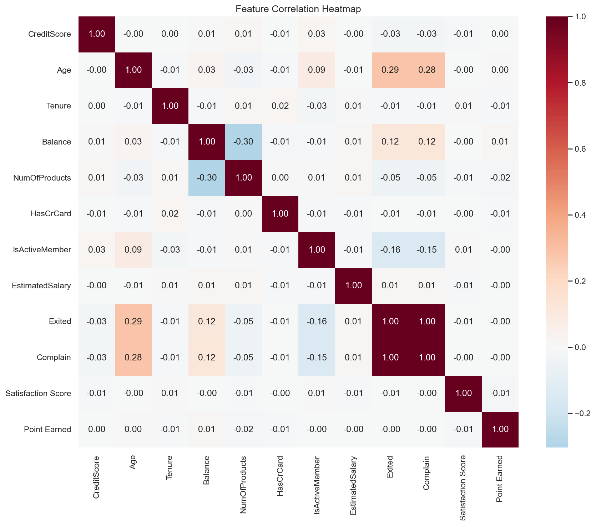

---

## Churn Rate by Customer Attributes

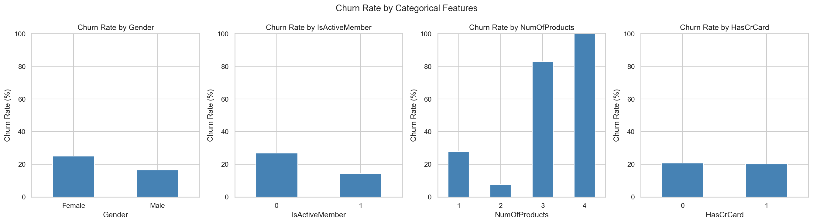

---

## Prediction Models

Both models trained on 80/20 stratified split. Logistic Regression uses StandardScaler; Decision Tree uses `max_depth=4, class_weight='balanced'`.

| Model | Accuracy | Precision | Recall | ROC-AUC |
|-------|----------|-----------|--------|---------|
| Logistic Regression | 86.3% | 77.1% | 55.7% | 0.869 |
| Decision Tree | 82.6% | 63.0% | 72.1% | 0.830 |

### Top Churn Drivers — Logistic Regression Coefficients

| Feature | Coefficient | Direction |
|---------|-------------|-----------|
| Complain | +5.18 | ⬆ Increases churn risk |
| Age | +0.85 | ⬆ Increases churn risk |
| IsActiveMember | −0.62 | ⬇ Decreases churn risk |
| Point Earned | −0.40 | ⬇ Decreases churn risk |
| Satisfaction Score | −0.21 | ⬇ Decreases churn risk |
| Geography_Germany | −0.12 | ⬇ Decreases churn risk |

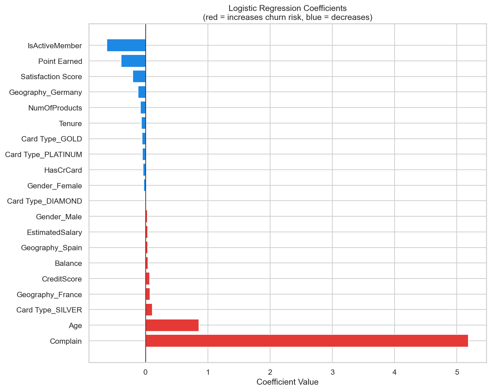

### Feature Importances — Decision Tree

| Feature | Importance |
|---------|-----------|
| Complain | **99.69%** |
| Point Earned | 0.13% |
| EstimatedSalary | 0.12% |
| Tenure | 0.03% |
| Geography_Germany | 0.03% |

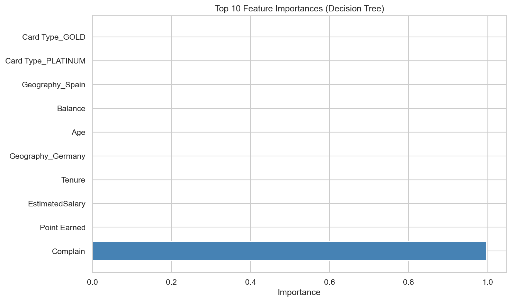

### Decision Tree (max_depth = 4)

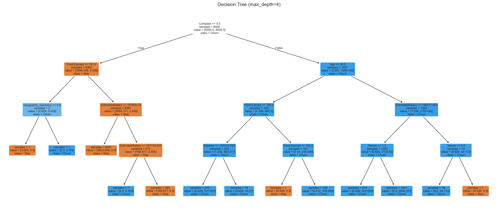

### Confusion Matrices

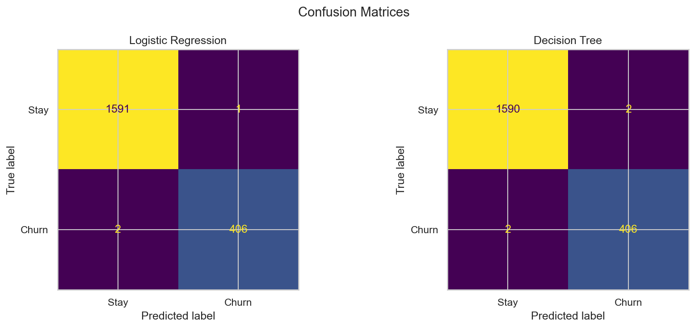

### ROC Curves

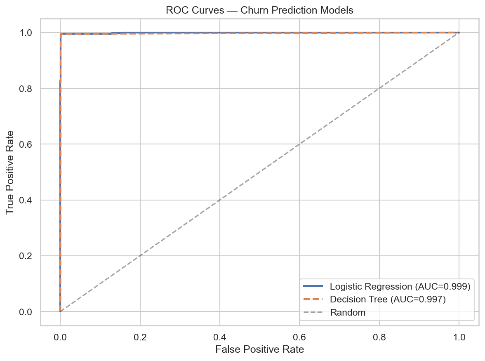

---

## Strategic Retention Playbook

| Theme | Key Driver | Target Segments | Recommended Actions |
|-------|-----------|-----------------|---------------------|
| 🚨 High Complaint Rate | Complain (LR coef +5.18) | All — especially SILVER/GOLD Germany | Proactive outreach + 48h complaint SLA with goodwill gesture |
| 😴 Inactive Members | IsActiveMember = 0 | Any card type, >60 days inactive | 2× points re-engagement offer + financial health review for high-balance inactives |
| 📦 3+ Products | NumOfProducts ≥ 3 | Any segment with 3–4 products | Free annual portfolio right-sizing + loyalty tier benefit |
| 🇩🇪 Germany GOLD & SILVER | Highest churn + complaint rate | GOLD Germany, SILVER Germany | Card upgrade campaign + churner survey to surface market pain points |
| ⭐ Low Satisfaction | Satisfaction Score < 3 | Any low-scoring segment | Quarterly NPS + 90-day satisfaction guarantee |

Full playbook with specific action steps: [04_recommendations.ipynb](notebooks/04_recommendations.ipynb)

---

## Notebooks

| # | Notebook | Description |
|---|----------|-------------|
| 1 | [01_eda.ipynb](notebooks/01_eda.ipynb) | Data quality, distributions, correlation heatmap |
| 2 | [02_segment_analysis.ipynb](notebooks/02_segment_analysis.ipynb) | Churn by card type & country, segment summaries |
| 3 | [03_prediction_model.ipynb](notebooks/03_prediction_model.ipynb) | Logistic Regression + Decision Tree, evaluation |
| 4 | [04_recommendations.ipynb](notebooks/04_recommendations.ipynb) | Risk segments + strategic retention playbook |

---

## Project Structure

```
├── notebooks/          # Analysis notebooks (run in order 01→04)
├── skills/
│   ├── utils/          # Shared Python utilities (plotting, scoring, segment helpers)
│   └── superpowers/    # Reference skill files used during project design
├── outputs/
│   ├── figures/        # Generated charts (PNG)
│   └── tables/         # Summary tables (CSV)
├── tests/              # pytest unit tests for utility modules
└── docs/               # Design spec and implementation plan
```

## Setup

```bash
pip install -r requirements.txt
jupyter notebook
```

## Running Tests

```bash
pytest tests/ -v
```
